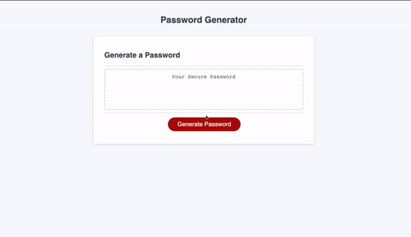

# password-generator

## Description
A website that allows the users to generate a random password with provided info such as (Length, special characters, numbers, uppercase and lowercase letters )

The website starts by asking the user how long they want their password to be, followed by four prompts asking the users the choices described above

# Usage

